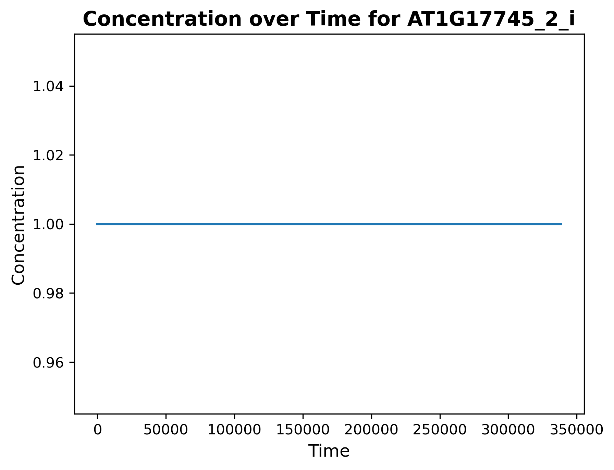
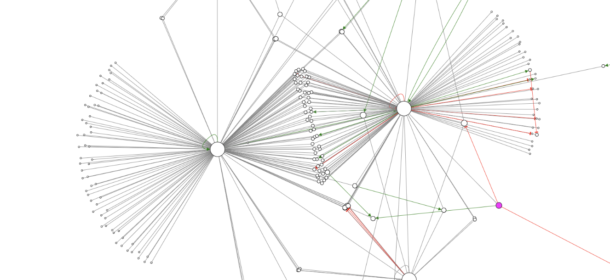

# Systems Biology Coursework

### View my hastily-made Svelte application to demonstrate the fold increases/decreases of gene expression over the course of the experiment in the context of a network!

http://arabidopsis-expression.s3-website.eu-west-2.amazonaws.com/

### Demonstrate using real data the following systems approaches and visualisations:

### • Download and process an omics dataset (10%)

The dataset used for this coursework is based on gene expression data over time of
Arabidopsis thaliana seeds. The dataset can be found here:
https://www.ebi.ac.uk/gxa/experiments/E-GEOD-94457/Results

Data import can be seen in **CELL 0**.

The gene expression data was already processed to be normalised to transcripts per million,
so no processing was required for normalisation of values. However, processing was required
to give the data useful headers and arrange datapoints in the correct order.

For this, Pandas was used as it has benefits in linking headers to columns and using gene names
as indexes in a more intuitive way than numpy.

The processing of the dataset can be seen primarily in **CELL 3**. It included renaming and ordering
columns according to the time since the beginning of the experiment, and transforming the data to
display the fold increase/decrease from one step to the next, as this is more useful than raw numbers.

### • Utilise an N-dimensional arrays for processing data (10%)

N-dimensional arrays were used in exploratory data analysis in **CELL 2**. 2-dimensional arrays
were used during the analysis, from which a % fold change from the minimum to the maximum value
was calculated to find the genes with the highest fold change over the time course.

### • Identify a model that contains a representation of part of your system (10%)

The use of several models from Biomodels were attempted; the following models
failed the SBML validation step on account of not having initial concentrations.
These failed Arabidopsis models included:

https://www.ebi.ac.uk/biomodels/BIOMD0000000416

https://www.ebi.ac.uk/biomodels/MODEL3618487388

https://www.ebi.ac.uk/biomodels/MODEL1507180028

All of these models gave the following warning when using SBML validator (https://sbml.org/validator_servlet/index.jsp):

> As a principle of best modeling practice, the \<species\> should set an initial value (amount or concentration) rather than be left undefined. Doing so improves the portability of models between different simulation and analysis systems, and helps make it easier to detect potential errors in models.

The model identified and used which had some overlap with the system was downloaded in **CELL 1**. The
model is entitled **'Whole Genome Metabolism - _Arabidopsis thaliana_'** and can be found here:

https://www.ebi.ac.uk/biomodels/BMID000000140799#Overview

There was some overlap of genes between the dataset and the model, although unfortunately
the most interesting genes, which appeared on the network as hubs with degrees of over 100,
did not appear in the model. In fact, the highest degree node from the network which was
also found in the model had a degree of 4, and none of the nodes to which it was connected
were found in the model.

### • Use differential equations to model a system (20%)

SBMLtoODEpy was used to run simulations based on the model found at https://www.ebi.ac.uk/biomodels/BMID000000140799. The simulations were
run on the following genes:

AT2G41220

AT1G17745

AT1G02640

AT1G17745

These were run over a time course of 92 hours, at 2-hour time intervals (7200 seconds), to
mimic the conditions of the experiment after the dry seed stage, at which stratification
treatment began.

However, all of these displayed only a horizontal linear trend, where the line is situated at +1.
This indicates a problem with the model.

These analyses occur in **CELLS 6, 7, and 8** of the Jupyter notebook.

### • Utilise a statistical tool to analyse a dataset (20%)

Statistical analysis was used to find genes with significant differential expression over
the time course. The dataset proved challenging as gene expression has a tendency to go up
and then down, or down and then up over the course of germination, leading to non-linearity
of data.

However, it was possible to identify 37 genes with significant linear regression p-values, all decreasing.
There were no genes found to have significant increases over the time course of the experiment.
This analysis was completed in **CELL 3**. Upon running this cell, results may be saved in the file
gene_expression_analysis_results_adjusted.txt by uncommenting the open and write lines in **CELL 3**.
This file can be examined to find the number of genes which showed positive linear trends and negative linear
trends over the time course.

In order to identify genes with significant non-linear trends, it was necessary during this analysis
to select a somewhat arbitrary value for a minimum fold increase which would be counted as significant.

For the majority of further steps, a fold increase of 500 between the minimum non-zero value and the maximum value
for a gene was considered significant. However, network analysis was additionally performed on those genes
with a fold increase of 100, as the networks generated by this fold increase showed additional hubs which
may be of interest in observing the effects of network peturbation.

In additon to linear regression, given the number of comparisons being made (26056 genes were included in the dataset),
adjusted p-values were calculated to avoid an excessive number of false positives being considered significant. This
was calculated using the Benjamini-Hochberg false discovery rate adjustment (also in **CELL 3**).

### • Generate a network and demonstrate how a perturbation to the system affects the network architecture (20%)

The (tragically mis-named and therefore more difficult to find than it needed to be) network used for analysis can
be found here:
https://www.ndexbio.org/viewer/networks/5df21e52-97c8-11e5-b435-06603eb7f303

Cytoscape was used to load this network. Data from the genes with significant differences (both at 500x and 100x fold
change) was added to the tables, and these genes were selected, along with their n=1 nearest neighbour, and isolated
into their own network. These networks were then exported as .cyjs files, which are in use in the arabidopsis-expression
application. Additionally, the adjacency matrix for each of these can be found in fold_increase_100_adjacency.adj and
fold_increase_500_adjacency.adj. These are plotted in the Jupyter notebook using matplotlib and networkx, in **CELL 5**.
However, for interactivity of networks, it is recommended to visit the page at which the arabidopsis-expression application
is currently being hosted; this application uses cytoscape.js and Svelte to create an interactive viewer for the
Arabidopsis timecourse data, for both 100 fold and 500 fold increase significance levels.

There appear to be several hubs in the network, the deletion of any of which results in a large number of orphan
nodes, as well as disrupting the connections between hubs which contain many genes which interact with more than one
node.

In the below image, two hubs share many nodes between them, as well as having a large number of nodes which are
connected to only one hub. The deletion of a hub therefore impacts not only the nodes directly connected
to it, but also the other hub. These hubs have high betweenness centrality and are therefore vital to the network
functioning correctly.

### • Provide a link to a GitHub repo for your analysis (10%)

Here we are, in the repo!
